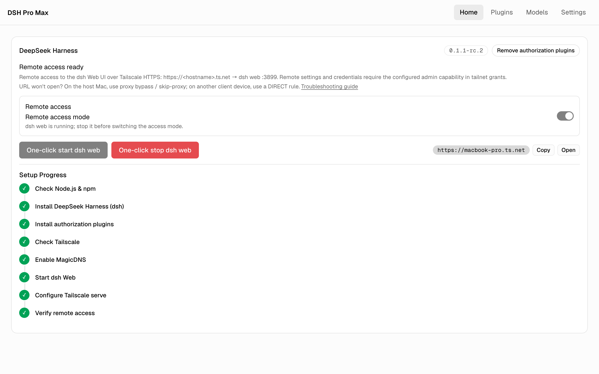
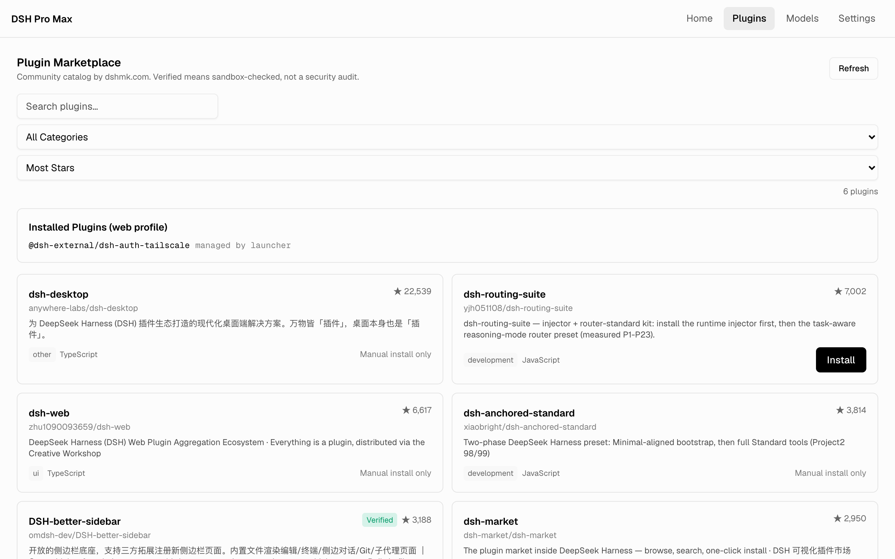
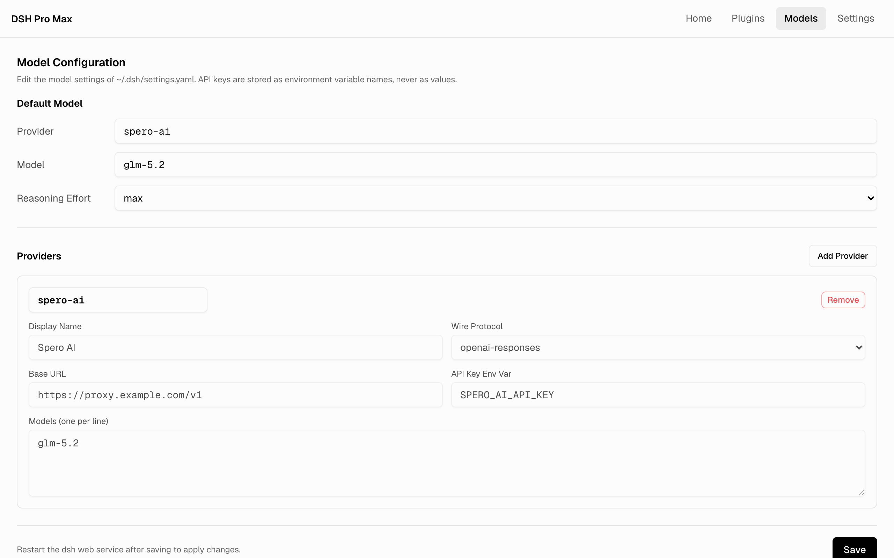
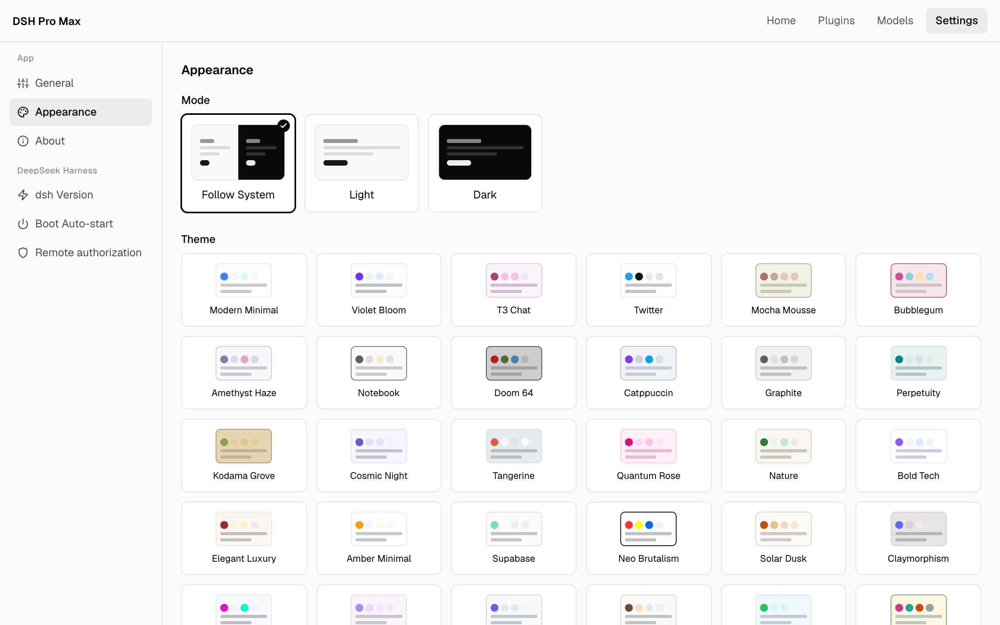

<div align="center">

# DSH Pro Max

**A desktop launcher for DeepSeek Harness — one-click local web UI and Tailscale-secured remote access.**

[](https://github.com/sperictao/dsh-pro-max/releases)
[](https://github.com/sperictao/dsh-pro-max/actions/workflows/quality.yml)
[](https://tauri.app)
[](https://www.typescriptlang.org)
[](https://www.rust-lang.org)
[](https://opensource.org/licenses/MIT)

[English](README.md) · [简体中文](README.zh-CN.md)

</div>

---

## ✨ Highlights

- 🌐 **DeepSeek Harness Remote Access** — one-click Tailscale HTTPS access to the dsh Web UI through bundled identity-authorization plugins, shown as an 8-step progress timeline with compatibility repair and boot auto-start
- 🛍 **Plugin Marketplace** — browse the dshmk.com community catalog (7000+ plugins) and one-click install/remove web profile plugins; the Verified badge comes from sandboxed install checks
- 🧠 **Model Configuration** — edit dsh's default model and custom LLM provider routes (OpenAI-compatible / Anthropic protocol) in-app; keys are stored as environment variable names only
- 🔌 **Bundled Auth Plugins** — two pinned plugins ([dsh-client-connection-authz](https://github.com/sperictao/dsh-client-connection-authz) + [dsh-auth-tailscale](https://github.com/sperictao/dsh-auth-tailscale)) ship inside the installer and are installed into the dsh web profile automatically
- 🔐 **Capability-Based Authorization** — configure your own admin/use capability domains and extra allowed Tailscale logins; without capabilities, remote privileged APIs stay 403
- 🎨 **Themes** — 42 tweakcn theme families with native light / dark / system modes; UI fonts self-hosted in-app, fully offline
- 🌍 **i18n** — English and Simplified Chinese UI, following the system by default
- 🔄 **Self-Update** — built-in Tauri Updater: check, download, restart, done
- ⌨️ **Keyboard** — `Cmd/Ctrl + ,` opens Settings

## 📸 Screenshots

| One-click Tailscale remote access | Plugin Marketplace |
| --- | --- |
|  |  |
| **Model Configuration** | **Themes & Appearance** |
|  |  |

## 📦 Install

Download the latest installer for your platform from [Releases](https://github.com/sperictao/dsh-pro-max/releases) (macOS `.dmg`, Windows `-setup.exe`, Linux `.AppImage` / `.deb`).

Prerequisites for the dsh features: **Node.js 18+**; for remote access additionally **Tailscale** with MagicDNS and HTTPS Certificates enabled (guided step by step in-app; see [docs/dsh-remote-access-setup.md](docs/dsh-remote-access-setup.md)).

## 🚀 Quick Start: Remote Access

Prerequisites: **Node.js 18+** on the host machine, and **Tailscale 1.92+** logged in with **MagicDNS** and **HTTPS Certificates** enabled.

1. On the Home tab, switch on **Remote access**.
2. Click **One-click start dsh web** — the 8-step timeline installs the pinned dsh with both authorization plugins, starts dsh Web, configures `tailscale serve`, and verifies the remote endpoint automatically.
3. In the Tailscale admin console (**Access controls**), allow your remote identity to reach the host node on port 443 (app capabilities never open ports):

   ```json
   {
     "grants": [
       { "src": ["alice@example.com"], "dst": ["autogroup:member"], "ip": ["tcp:443"] }
     ]
   }
   ```

4. From any device logged in to the same tailnet, open `https://<hostname>.ts.net` — the URL is shown on the Home tab once the timeline finishes.

Your host machine's current user is always allowed. Extra Tailscale accounts and remote **admin** capabilities (settings / credentials) are opt-in under **Settings → DeepSeek Harness → Remote authorization**.

→ Scenarios, capability setup and troubleshooting: [docs/dsh-remote-access-setup.md](docs/dsh-remote-access-setup.md)

## 🛠 Development

```bash
git clone --recurse-submodules https://github.com/sperictao/dsh-pro-max.git
cd dsh-pro-max
pnpm install
pnpm tauri dev
```

Domain terminology and semantic boundaries live in [CONTEXT.md](CONTEXT.md); design decisions in [docs/adr/](docs/adr/).

Quality gates: `pnpm test` (theme + component tests), `pnpm run check:i18n`, and `pnpm test:e2e` (browser smoke over a mocked Tauri IPC — requires Chrome).

## 📖 Origin

The DSH module was extracted from [Codex Pro Max](https://github.com/sperictao/codex-pro-max) (formerly dashi-taskboard-launcher) at v1.10.0 into this standalone app.

## License

MIT
