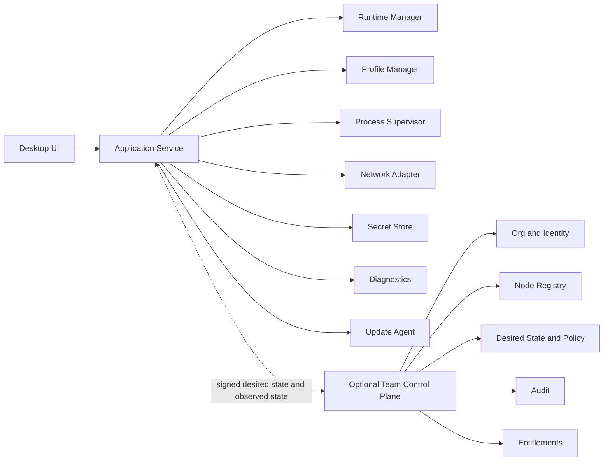
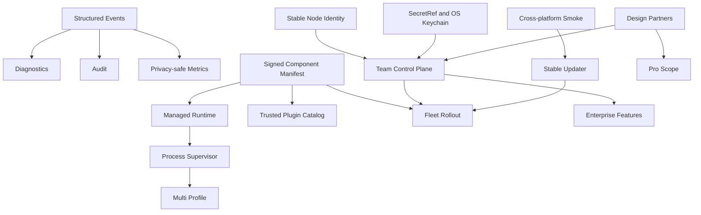

# DSH Pro Max 商业级软件进化路线图

> 状态：提案
> 形成日期：2026-08-30
> 基线：公开 v0.4.0；本地评估提交 `aeb0de4`
> 证据：见 [商业化演进调研基线](../research/commercial-product-evolution-primary-sources.md)

## 1. 结论先行

DSH Pro Max 不应该演变成一个“塞满功能的桌面壳”，也不应该复制 DeepSeek Harness 自己的聊天、Agent 或工具能力。更合适的商业定位是：

> **DeepSeek Harness 的本地优先运行、连接与运维控制台。**

它负责让 dsh 在个人电脑和团队节点上稳定安装、确定启动、安全连接、持续更新、快速恢复和可审计管理；dsh 继续负责 Agent 工作本身。

完整演进顺序应当是：

1. **可信桌面底座**：运行时、进程、配置、密钥、签名更新、诊断和跨平台验证；
2. **Pro 生产力**：多 profile、备份恢复、健康历史、自动修复、发布通道；
3. **Team 控制面**：组织、节点注册、角色、共享配置、审计和许可证；
4. **Enterprise Fleet**：策略、分批升级、SSO/SCIM、SIEM、MDM、离线与 SLA；
5. **平台生态**：签名插件、私有目录、API/CLI 和其他网络适配器。

“商业级”的第一道门是可信、可支持、可运营，不是功能数量。当前最优先的工作不是计费或 SSO，而是消除系统全局 Node/npm、detached 进程、非原子配置和可选签名发行带来的不确定性。

## 2. 规划假设

- 时间估算按 **2 名桌面全栈工程师 + 兼职产品/设计/QA** 计算；进入 Team 阶段后至少增加 1 名后端工程师。
- 单人开发时，阶段顺序不变，日历时间通常需要放大 2 至 3 倍。
- 路线图给出的是阶段门，不是必须按日期发布的承诺；上一阶段的退出条件未满足，不进入下一阶段。
- 当前 MIT 核心保持可用。商业价值优先来自受管服务、团队控制面、企业策略、支持与 SLA，而不是阻断已有本地能力。
- 安全更新、签名发行和基础诊断属于所有正式版本的底线，不能作为付费功能。

## 3. 当前成熟度判断

### 已经具备

- 单机 dsh 安装、启动、停止、修复和版本兼容检查；
- 本地与 Tailscale 远程访问两种模式；
- fail-closed 的身份和 capability 授权链；
- 8 步远程配置时间线与 problem/solution 恢复指引；
- 跨平台打包、托盘、自启动、窗口状态、多语言、主题和 updater；
- 清晰的 CONTEXT/ADR；当前前端、Rust、i18n、build、Clippy 和 mock Tauri IPC 浏览器 smoke 全绿。

### 只完成一半

- release 能构建多平台，但签名状态不是强制门，缺安装/更新 smoke、SBOM 和 provenance；
- updater 能验签和安装，但缺 staging、分批发布、回滚演练和不可变发布规则；
- 有本地日志，但缺诊断中心、脱敏支持包、crash 关联和支持流程；
- 有版本 pin，但运行时仍依赖系统 Node、全局 npm 和快速变化的 RC 上游；
- 有安全远程访问，但配置仍要求用户理解 capability 域名、Grants 和外部 Tailscale 管理面。

### 尚未形成

- 稳定节点身份、受管进程、健康历史、多 profile；
- Keychain/凭据引用、配置 schema migration、原子写和恢复；
- 用户、组织、角色、许可证、审计和 fleet；
- 隐私策略、遥测数据字典、支持政策、漏洞披露流程；
- 签名插件 manifest、权限声明、私有插件目录；
- 真实客户需求、付费意愿和留存数据。

## 4. 推荐目标客户与产品边界

### 4.1 优先客户

| 顺序 | 客户 | 要完成的工作 | 推荐产品 |
| --- | --- | --- | --- |
| 1 | 个人 AI 工程师、研究者、重度开发者 | 在一台机器上零折腾运行 dsh，并从其他设备安全访问 | Community / Pro |
| 2 | 2 至 20 人 AI 团队 | 管理几台共享或个人 dsh 节点，统一版本、配置和访问 | Team |
| 3 | 企业 AI 平台、IT、安全团队 | 管理节点 fleet、策略、身份、审计、升级和支持 | Enterprise |

先做个人和小团队。只有在至少 3 家设计伙伴明确需要时，才进入 SSO/SCIM、SIEM、air-gap 等企业能力。

### 4.2 应由 DSH Pro Max 拥有

- dsh runtime 与兼容组件的获取、验证、安装、升级和回滚；
- profile 生命周期、进程监管、健康状态和本机资源；
- Tailscale 等网络接入适配、连通性和授权配置验证；
- 本地偏好、节点期望状态、密钥引用和诊断；
- 组织级节点、策略、审计、entitlement 与 fleet；
- 官方签名插件的目录、兼容和权限声明。

### 4.3 不应拥有

- dsh 的 Agent、聊天、模型、工具和任务 UI；
- 一套与 Tailscale 冲突的网络 ACL；
- 未经管理员明确授权自动改写 tailnet policy；
- 云端托管用户的明文 dsh credentials；
- 任意远程 shell；
- 未签名、无权限声明的 npm 插件市场；
- 与核心价值无关的主题数量、社交、内容广场或移动端。

## 5. 产品版本与商业包装

| 版本 | 目标 | 包含能力 | 收费逻辑 |
| --- | --- | --- | --- |
| Community | 让单节点安全可用 | 受管 runtime、单 profile、本地/远程启动、签名更新、基础诊断 | MIT 核心与官方免费发行 |
| Pro | 让个人长期生产使用 | 多 profile、备份恢复、健康历史、自动修复、stable/beta 通道、高级诊断、优先支持 | 个人订阅或官方支持订阅；不锁安全更新 |
| Team | 让小团队可协作管理 | 组织、成员、角色、节点目录、共享模板、活动审计、许可证、托管控制面 | 组织基础费 + 活跃受管节点；避免复杂的多维计费 |
| Enterprise | 让 IT 和安全团队可治理 | SSO/SCIM、集中策略、fleet rollout、SIEM/webhook、MDM、私有部署、离线许可证、SLA | 年度合同，按节点规模和支持等级 |

### 商业原则

- 不先做重 DRM。若需要本地 Pro entitlement，使用签名许可证和明确宽限期，过期只停止付费服务，不破坏本地数据或基本启动。
- 现有 MIT 代码不能形成独占壁垒。壁垒应来自可信发行、受管组件、控制面、支持数据、组织工作流和生态质量。
- 在至少 20 个持续活跃节点和明确付费访谈前，不确定具体价格。
- Team 价值更接近“受管节点”而非纯 seat；成员数量可以作为套餐边界，但不要一开始同时按 seat、节点、用量三重计费。

## 6. 北极星指标与商业级门槛

### 6.1 北极星指标

**Weekly Healthy Nodes（每周健康节点）**

> 一周内至少一次由 Launcher 确认 dsh ready，并成功打开本地或远程入口的唯一节点数。

只记录健康事件，不采集 prompt、模型输出、credentials、文件内容或完整本机路径。用户未同意 telemetry 时，指标只在本地展示。

### 6.2 配套指标

| 类别 | 指标 | v1.0 目标 |
| --- | --- | --- |
| 激活 | 清洁机器首次本地 ready 成功率 | 实验室三平台各 20 次 100%；beta 实际 ≥95% |
| 激活 | 首次本地 ready P50 / P95 | ≤2 分钟 / ≤5 分钟 |
| 远程 | 已满足 Tailscale 外部前置后的 app-side ready 成功率 | ≥90% |
| 稳定 | crash-free sessions | ≥99.5% |
| 稳定 | dsh 非预期退出后恢复成功率 | ≥95% |
| 更新 | stable 更新成功率 | ≥99%；失败后旧版本仍可启动 |
| 发布 | 正式资产签名/公证/SBOM/provenance 覆盖 | 100% |
| 支持 | 可由诊断包直接定位的 P1/P2 工单 | ≥80% |
| 体验 | 首次关键流程键盘与屏幕阅读器阻断 | 0 |
| 隐私 | telemetry 中敏感内容事件 | 0 |

实际用户样本不足时，先报告样本数和实验室结果，不用小样本伪装成生产可靠性。

## 7. 目标架构

### 7.1 结构

### 7.2 桌面端领域

| 领域 | 单一职责 | 不变量 |
| --- | --- | --- |
| Runtime Manager | 管理 Node、dsh、第一方插件和组件 manifest | 不默认使用全局 npm；组件均有版本、digest、来源和状态 |
| Profile Manager | 管理一个或多个 dsh profile | profile ID 稳定；端口、目录和 runtime revision 一次绑定 |
| Process Supervisor | 启停、健康、崩溃和恢复 | 只停止自己登记的实例，不按宽泛命令行模式误杀 |
| Network Adapter | Tailscale 检测、Serve、Grants 生成/验证 | 网络授权与应用 capability 分开；无 Funnel 默认 |
| Secret Store | Keychain/Credential Manager/Secret Service 与 secret reference | 配置只存引用，不存明文 secret |
| Diagnostics | 结构化事件、健康历史、脱敏支持包 | diagnostic、telemetry、audit 各自独立 |
| Update Agent | app 与组件通道、staging、验签、回滚 | 未验签不安装；stable 发布不可变 |

### 7.3 控制面

第一版使用 **模块化单体 + PostgreSQL**，不要拆微服务。它只需要：

- 组织、成员、角色和邀请；
- 节点注册、公钥、状态与最后心跳；
- 版本化 desired state、组织默认和节点覆盖；
- 审计事件；
- entitlement 与许可证；
- 命令/状态同步。

控制面只能下发结构化、签名的期望状态，例如“节点进入 stable 通道”“应用 profile 模板 A”。它不能下发 shell 字符串。桌面端校验策略版本、签名、适用节点和允许动作后才执行。

### 7.4 事实来源

| 事实 | 权威来源 |
| --- | --- |
| 主题、语言、窗口行为 | 本机 Local Preferences |
| dsh 组件版本、digest、兼容矩阵 | 签名 Component Manifest |
| profile 期望状态 | 本机 Node Desired State；受管节点可由组织策略投影 |
| 进程与健康 | 本机 Observed State |
| credentials | OS secret store 或外部 secret manager；配置只持有 SecretRef |
| 组织、成员、角色 | Team Control Plane |
| 网络连通与 App Capability | Tailscale policy + 本机授权插件 |
| 套餐能力 | Entitlement Service / 签名离线许可证 |
| 审计 | 不可变 Audit Event Store |

不建立 dual-write。组织策略改变后生成新的 desired-state revision；本机应用该 revision 并回报 observed revision。

## 8. 分阶段路线图

### 阶段 0：产品证据与工程基线（0 至 3 周）

#### 目标

确定谁会付费、为什么付费，并建立后续所有阶段共用的指标、隐私和支持基础。

#### 交付

- **FND-01 客户发现**：访谈至少 10 名目标用户，争取 3 个持续使用的设计伙伴；覆盖个人、团队负责人和 IT/安全角色。
- **FND-02 Jobs Map**：验证本地启动、远程接入、共享节点、版本维护、故障支持五类工作，选出前两类付费动机。
- **FND-03 事件模型**：定义 `node.ready`、`runtime.install`、`process.exit`、`update.*`、`remote.verify` 等结构化事件及 correlation ID。
- **FND-04 隐私数据字典**：逐字段说明用途、同意、保留、导出和删除；明确不采集内容数据。
- **FND-05 支持入口**：新增 SECURITY、SUPPORT、Issue 模板、已知问题、支持版本和弃用策略。
- **FND-06 版本基线**：明确支持 OS、Node/dsh 兼容线、release channel 和安全修复窗口。

#### 退出条件

- 至少 3 个设计伙伴愿意连续使用 beta；
- 两个高频 Job 有重复证据，不靠一次性意见；
- 事件和隐私字段经代码、安全、产品共同确认；
- v1.0 范围砍到可信底座与明确高频流程。

### 阶段 1：可信商业底座（第 3 至 10 周，目标 v1.0）

#### 目标

让“安装、启动、更新、恢复、支持”在每个受支持平台上可预测。

#### P0 交付

- **CORE-01 Managed Runtime**
  - 短期先验证 Node 精确版本并修正 Node 18+/22.5+ 契约；
  - 中期把 Node、dsh 和内置插件安装到应用拥有的版本目录；
  - 用签名 component manifest 校验版本、digest、平台和兼容关系；
  - 原子切换 current revision，保留上一稳定 revision 用于回滚。
- **CORE-02 Process Supervisor**
  - 记录 instance ID、PID、start time、executable、profile 和 runtime revision；
  - 健康轮询、崩溃事件、有限重启退避、确定性停止；
  - 移除以宽泛命令行模式作为正常停止路径的设计。
- **CORE-03 Durable Config**
  - 配置增加 `schemaVersion`；
  - temp file + fsync + atomic rename；
  - 权限收敛、最近一次有效备份、显式迁移和损坏恢复；
  - 本机偏好与节点配置分文件。
- **CORE-04 Secret Store**
  - macOS Keychain、Windows Credential Manager、Linux Secret Service；
  - 只在配置保存 `SecretRef`；
  - 日志和支持包统一脱敏。
- **CORE-05 Trustworthy Release**
  - macOS Developer ID + Hardened Runtime + notarization + stapling；
  - Windows Authenticode/Artifact Signing + RFC 3161 timestamp；
  - 缺签名 secret 时 workflow 直接失败；
  - stable Release 不可删除重建；
  - 每个资产发布 digest、SBOM、provenance 和验签说明。
- **CORE-06 Updater Channels**
  - internal → beta → stable 晋级；
  - staging 环境真实安装与升级 smoke；
  - 失败保留旧版本，提供 pause、retry 和回滚路径；
  - updater key 轮换与丢失应急手册。
- **CORE-07 Cross-platform Smoke**
  - 三平台清洁 VM/机器完成安装、首次启动、本地 ready、停止、自启动、升级；
  - macOS 两架构；Windows 11；至少一个受支持 Ubuntu LTS；
  - CI 产物必须由真实 tool call/应用交互验证，不以进程启动代替。
- **CORE-08 Diagnostics Center**
  - 应用内健康摘要、最近事件和明确下一步；
  - 一键导出脱敏支持包，含版本、OS、component manifest、事件、日志尾部和校验结果；
  - 用户预览后才分享。
- **CORE-09 Permission Hardening**
  - 收窄 `shell:allow-open` 到固定文档、日志目录和可信 URL；
  - Tauri commands 明确输入类型和权限；
  - 对 PATH、registry、组件来源和日志敏感字段做威胁建模。
- **CORE-10 Onboarding**
  - 首次启动只问目标：“本机使用”或“远程使用”；
  - 环境扫描、自动修复、预计时间、可取消和恢复；
  - 内部端口、tgz、capability 注入细节默认隐藏，需要时再展开。

#### 退出条件

- 所有 v1.0 指标达到第 6 节门槛；
- 三平台各 20 次清洁安装和 stable 更新实验室 smoke 全绿；
- 正式 Release 资产 100% 签名/公证，附 SBOM/provenance；
- 配置断电测试与迁移测试通过；
- 支持包不包含 token、prompt、模型输出和完整敏感路径；
- 外部安全审查无未处理 Critical/High。

### 阶段 2：Pro 个人生产力（第 2 至 4 个月）

#### 目标

让个人用户能把 Launcher 当作长期运行工具，而不只是一次性安装器。

#### 交付

- **PRO-01 多 Profile**：独立 profile ID、用途、runtime revision、访问模式、资源目录和健康状态。
- **PRO-02 Profile 模板**：新建、克隆、归档、导出非敏感配置；secret 只导出引用说明。
- **PRO-03 备份恢复**：版本化备份、恢复预览、兼容迁移、恢复后验证。
- **PRO-04 健康历史**：可用性、启动耗时、崩溃、修复、更新结果；只保留本机或明确同意上传。
- **PRO-05 自动修复**：只处理确定性问题，展示将要改变的内容；不可自动改写 tailnet 全局策略。
- **PRO-06 远程向导 2.0**：根据身份和节点生成最小 Grants 片段、复制、重新检测；可选最小 scope OAuth 做只读验证。
- **PRO-07 First-party Catalog**：只允许签名的一方插件/兼容组件；展示权限、来源、版本和撤销状态。
- **PRO-08 Pro Entitlement**：试用、签名许可证缓存、离线宽限、恢复购买和明确降级行为。
- **PRO-09 自助支持**：诊断结果直达对应文档；可附支持包创建 Issue/工单。

#### 退出条件

- 至少 20 个每周健康节点连续 4 周；
- 至少 10 名 beta 用户完成多 profile 或备份恢复的真实使用；
- 付费访谈中有明确重复价值，不以“功能看起来多”作为购买证据；
- Pro 过期、离线和服务不可用时不破坏本地数据与 Community 能力；
- P1 支持问题中至少 60% 可通过诊断和文档自助解决。

### 阶段 3：Team 控制面（第 4 至 8 个月）

#### 目标

让小团队知道有哪些节点、谁能做什么、配置是否一致、发生过什么。

#### 交付

- **TEAM-01 身份与组织**：组织、成员、邀请、组和最小角色集。
- **TEAM-02 稳定节点身份**：首次注册生成设备密钥与 Node ID；支持撤销、转移和重注册。
- **TEAM-03 Node Inventory**：在线状态、OS、Launcher/dsh 版本、profile、健康和最后心跳。
- **TEAM-04 Desired State**：组织默认、标签分组、节点覆盖、revision、冲突和回滚。
- **TEAM-05 RBAC**：Viewer、User、Operator、Admin；权限映射到资源和动作，不映射到页面。
- **TEAM-06 审计**：actor、action、target、result、time、node、version、correlation ID；可搜索和导出。
- **TEAM-07 Shared Templates**：共享非敏感 profile/插件/访问模板；secret 保持引用。
- **TEAM-08 License Lifecycle**：分配、撤销、邀请、宽限和账单状态与产品权限分离。
- **TEAM-09 Secure Command Queue**：只接受签名的声明式动作，支持幂等、超时、取消和结果回报。
- **TEAM-10 Tailscale Adapter**：Grants 生成/验证、最小 scope OAuth、外部修改审计；不吞掉 tailnet 的事实来源。

#### 退出条件

- 至少 3 个设计伙伴组织，每个组织管理 5 至 20 个真实节点；
- desired state 24 小时内收敛率 ≥99%，失败有明确节点和原因；
- 权限矩阵、撤销、离职和节点丢失场景通过集成测试；
- 审计覆盖 100% 管理性动作；
- 控制面故障时节点继续按最后有效状态运行，不影响本地基本使用。

### 阶段 4：Enterprise Fleet（第 8 至 14 个月）

#### 目标

满足 IT、安全、采购和支持团队的治理要求。

#### 交付

- **ENT-01 SSO/OIDC/SAML 与 SCIM**：只在明确客户需求和身份提供商矩阵后实现。
- **ENT-02 Fleet Rollout**：按标签/百分比/环分批；pause、cancel、rollback 和 blast-radius 限制。
- **ENT-03 Central Policy**：远程访问、更新通道、插件、诊断上传和本机覆盖的强制/默认/禁止状态。
- **ENT-04 MDM 与静默部署**：签名安装包、silent install/uninstall、预配置和版本锁。
- **ENT-05 SIEM/Webhook**：审计和安全事件流，重试、签名、dead-letter 和 schema version。
- **ENT-06 私有/离线部署**：自托管控制面、离线 component catalog、离线签名许可证；仅由付费设计伙伴驱动。
- **ENT-07 安全与合规包**：威胁模型、SBOM、漏洞披露、依赖策略、渗透测试摘要、DPA/隐私材料和事件响应。
- **ENT-08 SLA 与运营**：状态页、on-call、事件等级、RTO/RPO、支持升级和客户沟通模板。

#### 退出条件

- 进入开发前已有书面设计伙伴需求或付费承诺；
- 100 节点测试 fleet 的分批升级、暂停和回滚通过；
- 外部渗透测试无未处理 Critical/High；
- 控制面备份恢复演练达到约定 RTO/RPO；
- SSO/SCIM、审计导出和策略锁定通过真实客户环境验收。

### 阶段 5：平台生态（第 12 至 18 个月以后）

只有在 Pro/Team 留存成立后启动：

- **PLAT-01 插件 manifest**：唯一 ID、版本、publisher、digest、签名、兼容范围、权限、入口和撤销。
- **PLAT-02 私有目录**：组织审批、允许列表、版本 pin、分批发布和回滚。
- **PLAT-03 SDK/CLI/API**：围绕 profile、node、health、desired state 和 audit，不暴露内部文件格式。
- **PLAT-04 网络适配器接口**：Tailscale 保持第一实现；只有客户重复需要时才支持其他私网。
- **PLAT-05 Policy as Code**：schema、预览、验证、审批和审计。

第三方插件市场必须晚于权限模型、签名、隔离、审核和撤销能力。否则它会把商业软件变成供应链入口。

## 9. 关键依赖关系

不能跳过的顺序：

- 没有 managed runtime 和 supervisor，不做 fleet；
- 没有稳定 Node ID 和 desired-state revision，不做远程批量操作；
- 没有 audit event，不做企业策略；
- 没有签名 component manifest，不做插件目录；
- 没有客户证据，不做 SSO/SCIM 和 air-gap。

## 10. 前 90 天执行计划

### 0 至 30 天

1. 完成 10 次用户访谈和 3 个设计伙伴招募；
2. 修复 Node 版本契约，形成 Managed Runtime ADR；
3. 配置加 `schemaVersion`、原子写、权限和备份；
4. 正式发布改为签名缺失即失败，停止删除重建同名 Release；
5. 新增 SECURITY、SUPPORT、隐私数据字典和支持版本政策；
6. 定义结构化事件与脱敏规则；
7. 建立三平台清洁安装 smoke 脚本/清单。

### 31 至 60 天

1. 交付 managed runtime MVP 与签名 component manifest；
2. 交付 Process Supervisor，旧 pattern-kill 只作为迁移清理路径；
3. 接入 OS secret store；
4. 交付诊断中心和用户可预览的支持包；
5. 建立 internal/beta/stable 更新通道和 staging；
6. 发布 SBOM、digest 和 provenance；
7. 首轮可用性和安全审查。

### 61 至 90 天

1. 完成 onboarding 和远程向导 2.0；
2. 跑三平台各 20 次安装/升级/回滚 smoke；
3. 招募 beta，测量 activation、ready time、crash-free 和 support self-resolution；
4. 做多 profile 技术切片，但只在单 profile 底座稳定后合入；
5. 依据真实使用决定 Pro 的前三项付费价值；
6. 形成 v1.0 发布候选和 go/no-go 评审。

## 11. 代码演进顺序

当前不需要“大重写”。在保持现有行为和 IPC 契约的前提下，按新能力抽取：

1. 从 `dsh.rs` 抽出纯解析与值对象：版本、profile ID、component manifest、desired/observed state；
2. 抽出 `RuntimeManager`，让安装和兼容判断只走这一入口；
3. 抽出 `ProcessSupervisor`，替换 detached + pattern-kill 的正常路径；
4. 抽出 `NetworkAdapter` trait 与 `TailscaleAdapter`；
5. 抽出 `Diagnostics` 与统一事件；
6. 最后保留一个薄 `DshApplicationService` 编排 use case；
7. 前端按 onboarding、profiles、health、updates、settings feature 分区，跨 feature 只通过 shared store/commands。

建议新增 ADR：

- ADR-0011 Managed Runtime Ownership
- ADR-0012 Durable Config and SecretRef
- ADR-0013 Process Supervision
- ADR-0014 Signed Component Manifest and Update Channels
- ADR-0015 Diagnostic, Telemetry and Audit Separation
- ADR-0016 Stable Node Identity and Desired State
- ADR-0017 Community/Pro/Team Entitlement Boundary
- ADR-0018 Plugin Trust and Permission Model

## 12. 安全、隐私与支持底线

### 安全

- 正式安装包、更新包、组件和插件全部可验证；
- Tauri capability 最小化，IPC 输入在 Rust 边界验证；
- runtime 不从不受控 PATH 随机选择；
- secret 进入 OS secret store，日志默认脱敏；
- 远程仍为 loopback + Tailscale Serve + deny-by-default；
- Team 控制面没有任意 shell，所有动作幂等、签名、可取消、可审计；
- 发布密钥有备份、轮换、撤销和双人操作流程。

### 隐私

- 默认不上传 prompt、输出、文件内容、credentials、完整路径或 tailnet policy；
- telemetry、crash、diagnostic、audit 分开开关和数据字典；
- 用户可查看、导出、删除自己的云端数据；
- 企业管理员可统一禁止 telemetry，但不能删除安全审计义务；
- 控制面只保存 secret reference 和必要 metadata。

### 支持

- 每个错误有原因、下一步、correlation ID 和对应文档；
- 支持包由用户预览后分享；
- 每个 stable 版本有支持期限、已知问题和回滚说明；
- P0/P1 事故有状态页、事件时间线和复盘；
- Community、Pro、Team、Enterprise 的响应时间和支持范围写清楚。

## 13. 风险登记

| 风险 | 早期信号 | 缓解 |
| --- | --- | --- |
| dsh RC 高频变化 | 一周内多次兼容修复 | signed manifest、兼容矩阵、stable channel、上一版本回滚 |
| Node/npm 环境漂移 | 用户机器复现不了 CI | app-owned runtime，不默认依赖全局 npm |
| Tailscale 配置支持成本 | 大量 grant/capability 工单 | adapter、最小片段生成、read-only 验证、清晰责任边界 |
| 跨平台差异 | 只在某 OS 失败 | 明确支持矩阵、真实安装 smoke、平台 owner |
| 开源难收费 | 用户愿用但不愿买本地二进制 | 收费放在团队控制面、企业策略、支持和官方服务 |
| 过早企业化 | SSO/SCIM 开发无客户 | 设计伙伴与书面需求作为进入门 |
| 诊断泄密 | 支持包包含 token/路径 | allowlist 字段、自动脱敏、用户预览、安全测试 |
| 插件供应链 | 任意 npm 包拥有宿主权限 | 一方签名目录优先；权限/隔离/撤销前不开放市场 |
| 控制面扩大攻击面 | 远程批量动作被滥用 | 设备密钥、签名 desired state、最小角色、完整审计 |
| updater key 丢失 | 已装客户端无法升级 | 离线备份、轮换设计、演练和应急渠道 |

## 14. 明确不做

- 不增加新的主题族作为商业化主线；
- 不把端口、tgz、capability env 等内部细节直接暴露给普通用户；
- 不复制 dsh 的聊天、模型、Agent 和工具 UI；
- 不使用 Tailscale Funnel 作为默认商业远程方案；
- 不自动修改客户 tailnet policy；
- 不在现有 `LauncherConfig` 塞入组织、成员和账单字段；
- 不在没有节点锁、回滚和审计时提供“一键全 fleet 升级”；
- 不在没有权限和签名模型时开放第三方插件；
- 不为早期控制面拆微服务；
- 不在用户价值未验证前做移动端、Marketplace、SSO/SCIM 或 air-gap。

## 15. v1.0 商业级完成定义

只有同时满足下列条件，才把产品称为商业级 v1.0：

- 清洁机器可以不理解 Node/npm 即完成本地 ready；
- app 只管理自己登记的 runtime、profile 和进程；
- 配置可迁移、原子保存、损坏可恢复，secret 不进普通 JSON；
- 所有正式资产已签名、公证、timestamp、验签，并附 SBOM/provenance；
- 三平台安装、启动、停止、更新、回滚真实 smoke 全绿；
- 错误在应用内给原因和下一步，支持包可脱敏导出；
- updater 有 internal/beta/stable 与不可变 stable 发布；
- 已发布 SECURITY、隐私、支持版本、漏洞响应和回滚政策；
- 至少 3 个设计伙伴连续使用，核心激活与稳定指标达到门槛；
- 无未处理 Critical/High 安全问题。

这一定义达到后，产品即使功能还不多，也已经具备可卖、可用、可更新、可支持的商业基础；此后增加 Pro、Team 和 Enterprise 能力才不会放大底层不确定性。

## 16. 路线图治理

- 每个阶段建立一个 parent Issue，交付项按本文 ID 拆成可验收子 Issue；
- 每项必须写用户结果、非目标、依赖、数据/安全影响和可重复验收；
- 每两周评审指标、设计伙伴反馈和风险，允许删除路线图项；
- 每个 Release 只从已达到 stage gate 的能力晋级；
- 路线图每季度重审一次，真实使用数据优先于本文假设。
